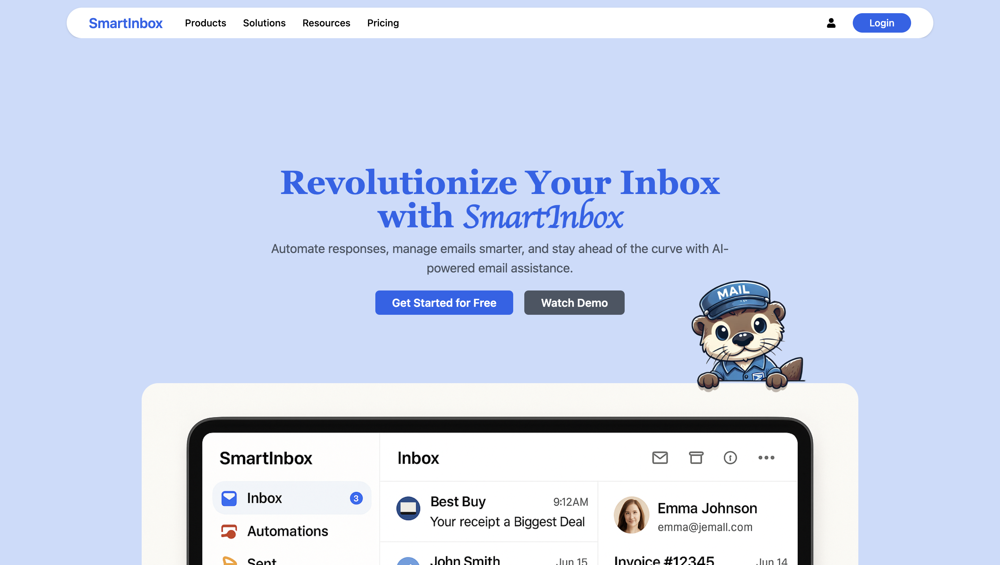

# SmartInbox  
**SmartInbox** is a full-stack, AI-powered Gmail assistant designed to intelligently manage, categorize, and reply to your emails using a custom RAG (Retrieval-Augmented Generation) model and *OLAMA + GROQ AI*. Built with scalable microservices, it integrates task scheduling with RabbitMQ and orchestrates services using Kubernetes.

---

## Project Demo

[](Documentation/Project_Demo.mp4)


---

## Key Features

- **Context-Aware Email Categorization**  
  Emails are analyzed and Replied using a user-specific context, allowing highly relevant responses acoording to user's tone and behaviour.

- **AI-Powered Reply Generation**  
  Responses are generated using a RAG-based AI model with Groq for fast inference and external context retrieval.

- **Automatic Inbox Management**  
  Emails are labeled, categorized, and archived automatically using Gmail API integrations.

- **Per-User Context & Metrics**  
  A form-based user onboarding collects context and tracks metrics for each user for accurate response generation and dashboard summaries.

- **Scalable Microservices Architecture**  
  RabbitMQ ensures smooth communication, and Kubernetes handles deployment, scaling, and service management.

---

## System Architecture


---

## Tech Stack

| Layer         | Tools / Frameworks                                    |
|--------------|--------------------------------------------------------|
| Frontend     | React, Vite, TailwindCSS                               |
| Backend      | Node.js (Express), MongoDB                             |
| AI / NLP     | OLAMA(Embeddings) , Groq API(RAG model)                |
| Messaging    | RabbitMQ (task queue for email and response pipelines) |
| Infrastructure | Docker, Kubernetes                                   |
| Email        | Gmail API                                              |

---

## Project Structure
```
smartinbox/
├── contextservice/         # React frontend for user context collection
├── MailCronJob/            # Cron job that fetches Gmail emails periodically
├── MailService/            # Categorization and label assignment logic
├── ResponseService/        # RAG model for response generation
├── UserService/            # User auth, context, metrics, dashboard
├── Kuberenetes/            # All YAMLs for deployments, services, scaling
├── Documentation/          # Architecture diagrams and technical docs
```
---

## Microservices Breakdown

### 1. MailCronJob
- Scheduled job to fetch new Gmail emails.
- Pushes emails to RabbitMQ queues.

### 2. MailService
- Preprocess emails and sents to the Response Service.
- Applies Gmail labels and sends emails usi Gmail API.

### 3. ResponseService
- Uses a RAG pipeline for reply generation.
- Retrieves user context from MongoDB.
- Uses Groq for low-latency text generation.
- Uses Groq to summarize the converstions between the sender and AI.

### 4. UserService
- Auth (signup/login), context management, and dashboards.
- Provides email summaries and user-specific analytics.

### 5. contextservice (Frontend)
- A 4-step form to gather user context.
- Serves the SmartInbox user interface.
- Provides summary views and metrics visualization.

---

## Kubernetes & Deployment

```
Kuberenetes/
├── Deployments/            # Each microservice as a Deployment
├── Services/               # ClusterIP services to expose Deployments internally
├── PodScaling/             # HPA configuration for autoscaling
├── rabbitmq/               # Stateful RabbitMQ setup with configMaps and PVC

All services are Dockerized and managed in the cluster.
```
---

## RAG AI Model Overview

- Located in `ResponseService/Controllers/RAG_AI_MODEL.js`
- Combines:
  - User context (from DB)
  - Email content (fetched via Gmail API)
  - External info (RAG retrieval)
- Returns a refined, context-aware reply.
- Tracks metrics and stores feedback for future tuning.

---

## Development Setup

```bash
# Start all services locally (example for MailService)
cd MailService
npm install
npm run dev

# For RabbitMQ, use Docker or Kubernetes
kubectl apply -f Kuberenetes/rabbitmq/
```
---

## Made By

**Vivek Shaurya**
🔗 GitHub: [@mrperfect0603](https://github.com/mrperfect0603)

---

> **SmartInbox** isn’t just email automation — it’s your AI-powered assistant that understands your conversations and works for you.

